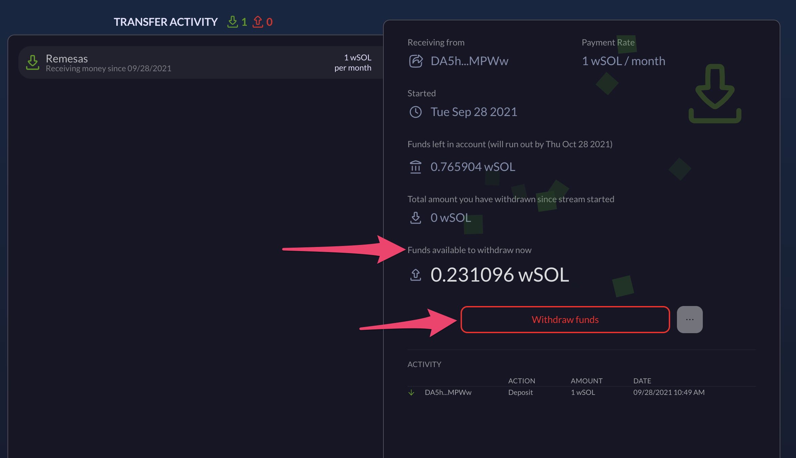

# Penarikan

### Penarikan **(untuk Transfer)**

Bila Anda adalah penerima transfer, Anda akan melihat transfer masuk di bawah tab Transfer. Jumlah yang tersedia untuk penarikan ditunjukkan dalam rincian transfer.

Saat Anda siap untuk menarik, cukup klik tombol "Tarik dana", dan tentukan jumlahnya. Setelah penarikan dikonfirmasi di dompet Anda, uang akan muncul di bawah akun yang sesuai.
